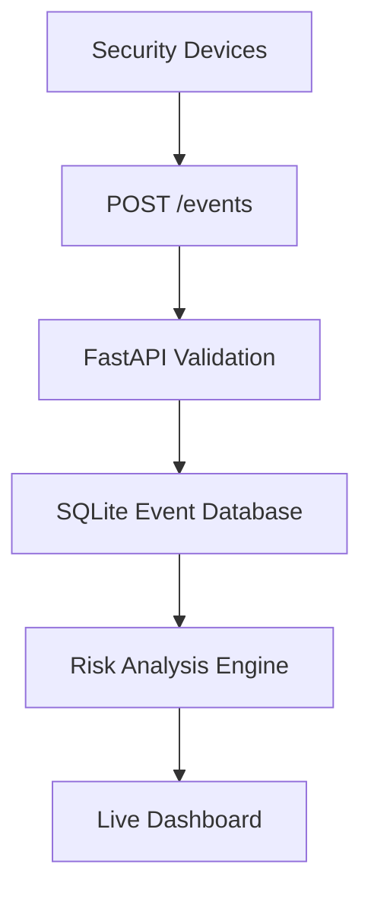

# AI Security Data Platform

An embedded security-data system that collects device events, validates and stores them locally, calculates explainable risk scores, and displays activity through a live dashboard.

The project was developed as a modular foundation for integrating cameras, motion sensors, environmental sensors, robotic platforms, and future machine-learning models.

## Current Capabilities

- FastAPI security-event API
- SQLite local event storage
- Pydantic input validation
- Camera, motion, door, and environmental event support
- Configurable security-device simulator
- Live responsive dashboard
- Explainable risk scoring
- Individual and batch event analysis
- Automatic API documentation
- Six automated tests
- Modular hardware and software structure

## System Architecture



Security devices send JSON event records to the API. The platform validates each event, stores it in SQLite, and calculates a risk assessment using severity, detection confidence, and event type. The dashboard retrieves analyzed events and displays the results.

## Risk Analysis

The current analysis engine is a transparent, rule-based baseline. It does not claim to be a trained machine-learning model.

Each event receives:

- A numeric score from `0–100`
- A risk level: `low`, `guarded`, `elevated`, `high`, or `critical`
- Plain-language reasons explaining the result

The score combines:

- Reported event severity
- Detection confidence
- An event-specific risk adjustment

This explainable baseline provides a measurable reference for future anomaly-detection and machine-learning development.

## Technology Stack

- Python
- FastAPI
- Uvicorn
- Pydantic
- SQLite
- HTML, CSS, and JavaScript
- Pytest
- Arduino C++ for the pan-tilt hardware controller

## Project Structure

```text
AI-Security-Data-Platform/
├── app/
│   ├── static/
│   │   └── dashboard.html
│   ├── __init__.py
│   ├── analysis.py
│   ├── database.py
│   ├── main.py
│   └── models.py
├── data/
│   └── security_events.db
├── hardware/
│   └── pan_tilt_camera/
│       └── pan_tilt_camera.ino
├── scripts/
│   └── device_simulator.py
├── tests/
│   └── test_api.py
├── .gitignore
├── LICENSE
├── README.md
└── requirements.txt
```

The local database and Python virtual environment are excluded from GitHub.

## Windows Setup

Clone the repository and enter its folder:

```powershell
git clone https://github.com/trent229/AI-Security-Data-Platform.git
cd AI-Security-Data-Platform
```

Create and activate a virtual environment:

```powershell
py -m venv .venv
.\.venv\Scripts\Activate.ps1
```

Install the dependencies:

```powershell
python -m pip install --upgrade pip
python -m pip install -r requirements.txt
```

## Run the Platform

Start the FastAPI server:

```powershell
python -m uvicorn app.main:app --reload
```

Open the dashboard:

```text
http://127.0.0.1:8000/dashboard
```

Open the interactive API documentation:

```text
http://127.0.0.1:8000/docs
```

## Run the Device Simulator

Leave the API running and open a second PowerShell terminal.

Activate the environment:

```powershell
.\.venv\Scripts\Activate.ps1
```

Send five simulated events:

```powershell
python scripts\device_simulator.py --count 5 --interval 0.5
```

The simulator generates events from example cameras, door sensors, and environmental sensors.

## API Endpoints

| Method | Endpoint | Purpose |
|---|---|---|
| `GET` | `/` | Display platform status |
| `GET` | `/health` | Run a service health check |
| `GET` | `/dashboard` | Display the live dashboard |
| `POST` | `/events` | Store a security event |
| `GET` | `/events` | Retrieve recent events |
| `GET` | `/events/analysis` | Retrieve events with risk assessments |
| `GET` | `/events/{event_id}/analysis` | Analyze one stored event |

## Example Event

```json
{
  "device_id": "pan-tilt-camera-01",
  "event_type": "motion_detected",
  "severity": "medium",
  "description": "Movement detected in the camera field of view",
  "confidence": 0.95
}
```

## Automated Testing

Run the complete test suite:

```powershell
python -m pytest -v
```

The tests verify:

- API health
- Event creation and retrieval
- Invalid confidence rejection
- Dashboard availability
- Individual risk analysis
- Batch event analysis

Current verified result:

```text
6 passed
```

## Hardware Integration

The repository includes an Arduino pan-tilt controller sketch. The software architecture also supports future input from:

- USB or CSI cameras
- PIR motion sensors
- Door-position sensors
- Environmental sensors
- NVIDIA Jetson edge computers
- Raspberry Pi devices
- Mobile robotic platforms

The current simulator allows the data platform to be developed and demonstrated before every physical device is connected.

## Privacy and Data Handling

The platform is designed for local-first operation. Events are stored in a local SQLite database, and no cloud service is required for the current prototype.

## Development Status

Functional prototype:

- Event API operational
- Local database operational
- Simulator operational
- Dashboard operational
- Risk analysis operational
- Six automated tests passing

## Planned Improvements

- Statistical anomaly detection
- Machine-learning model integration
- Authentication and role-based access
- Device registration and management
- Configurable alert thresholds
- Event filtering and search
- Image and video evidence references
- PostgreSQL deployment option
- Secure remote synchronization

## Author

Trinity Matthew Ison  
Robotics and Embedded Systems  
Developed as an embedded systems and security-data platform project.